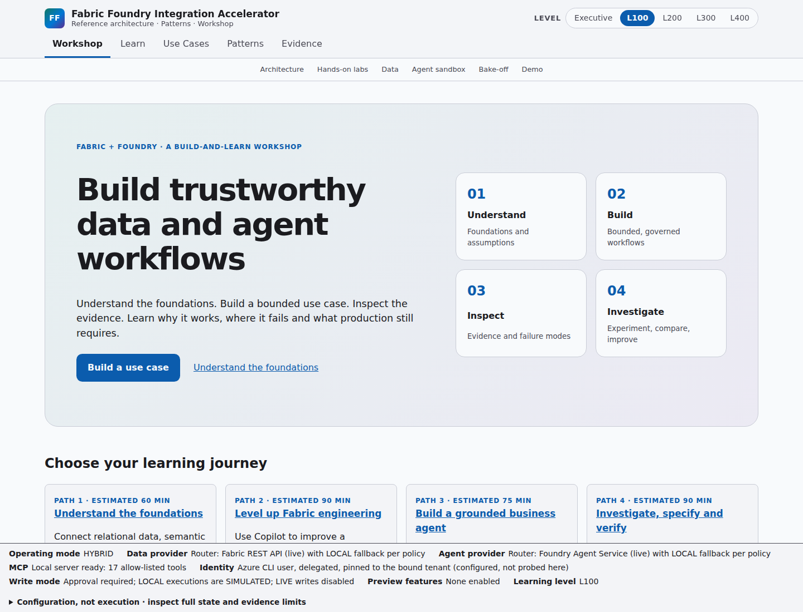
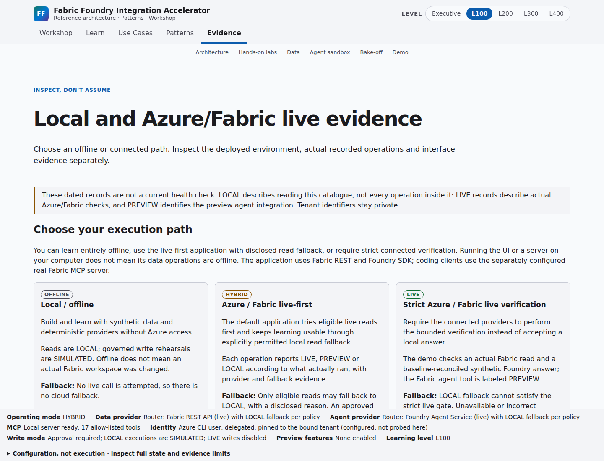

# Fabric Foundry Integration Accelerator

A reusable, customer-neutral **reference implementation, pattern catalog, workshop and demo
environment** for integrating **Microsoft Fabric** and **Microsoft Foundry**. It covers:

- **Fabric:** Fabric MCP, Fabric Skills, Fabric IQ, Fabric Data Agents
- **Agents and AI coding tools:** Microsoft Agent Framework, GitHub Copilot, Claude Code
- **Data engineering:** medallion architecture, Open Mirroring recovery
- **Governance and evidence:** human-in-the-loop actions, evaluation and observability

> **Fabric provides governed business context. Foundry turns that context into reasoning,
> orchestration, evaluation, and action. MCP standardizes access to capabilities. Enterprise
> identity and policy determine authority. Deterministic validation and human oversight
> constrain high-impact actions. Observability and evaluation provide evidence. Offline
> resilience ensures the architecture can always be demonstrated and taught.**

Learn it · See it · Build it · Run it · Break it · Recover it · Inspect it · Evaluate it ·
Customize it · Productionize it — in one project, with **synthetic data only**.

## Status

| Phase | Scope | Status |
|---|---|---|
| 0 | Research + architecture | ✅ Complete |
| 1 | Repository foundation: uv/Python, React/TS/Vite, instructions, docs, quality tooling, CI | ✅ Complete |
| 2 | Offline-first data foundation (synthetic medallion, recovery fixtures, Local Fabric Provider, dataset profiles) | ✅ Complete |
| 3 | Application control plane (FastAPI, FastMCP, providers, router, circuit breaker, approvals, audit) | ✅ Complete |
| 4 | Interactive educational application (explorers, learning paths, labs, guides, demo mode) | ✅ Complete |
| 5 | Fabric integration (live read-only provider, gated writer, MCP profiles, skills, reference notebooks) | Implemented; external Core/IQ MCP integrations are profiles/documentation, not additional in-process adapters. Fresh Guide 1 MCP/Power BI execution requires its assigned tools. |
| 6 | Foundry integration (agent port, LOCAL + Foundry agents, evaluation, tracing, Agent Framework workflow, Foundry IQ knowledge analog behind a preview flag) | ✅ Complete; dated live eval 5/5, live draft held by review gate; client telemetry ingestion verified, new server-side tracing still requires tenant verification |
| 7 | GitHub Copilot + Claude Code (skills, prompt packs, bake-off) | ✅ Complete; ten recorded Copilot CLI model runs; Claude Code DOCUMENTED ONLY |
| 8 | Security, CI/CD and production readiness | ✅ Repository implementation and LOCAL checks complete; CodeQL/release execution and production checklist remain external verification |
| 9 | Final validation | ✅ LOCAL workshop regression checks passed on 2026-10-09; latest full Python suite 616 passed, frontend suite 99 passed, 30/30 education and zero-cloud offline demo. GitHub and production checks remain separate. |

Use-Case Guides under `guides/`: **HC-01** (Fabric MCP + Power BI medallion lab, healthcare,
synthetic) and **MFG-01** (Foundry + Fabric sales insights, manufacturing, synthetic).

Workshop talk tracks (presenter scripts with portal, VS Code, web app and offline paths, generated
from YAML with `ffia talktracks render`, also linked from the app's Demo page):

- **Guide 1:** [Leveling up Fabric data engineering with GitHub Copilot](demos/fabric-copilot-level-up/index.html)
- **Guide 2:** [Foundry + Fabric agent workshop](demos/foundry-fabric-agents-workshop/index.html)
  (manufacturing, synthetic; offline commands `ffia mfg brief`, `ffia mfg quality`,
  `ffia agents ask|eval|workflow`, and the app's Agent page)
- Morning setup: [demos/MORNING-RUNBOOK.md](demos/MORNING-RUNBOOK.md)

Both guides also have generated [Copilot](prompts/github-copilot/patterns.md) and
[Claude Code](prompts/claude-code/patterns.md) prompt packs. The recorded bake-off compares
Claude and GPT models **inside Copilot CLI**, not Copilot versus Claude Code.
Replay evidence offline at `/bakeoff`; no new cloud operation occurs during replay.

See [security and threat model](docs/security/README.md),
[release validation](docs/operations/release-validation.md) and
[observability evidence](infra/observability/README.md). The education completeness gate covers
all 30 questions across Executive and L100-L400. See the
[phase verification and current live evidence](docs/operations/phase-verification.md).
Capacity activation starts billing and remains an explicit human operation.

## Build-and-learn workshop

The app's primary navigation is **Workshop, Learn, Use Cases, Patterns and Evidence**.
Architecture, labs, data exploration, the agent sandbox and recorded bake-off remain available
as workshop tools. `/use-cases` is canonical; existing `/guides` deep links still work.

- **Breadth:** four outcome-led journeys and 25 patterns, all linked to five-level teaching.
- **Depth:** 21 lessons, Executive through L400, with 130 knowledge checks and five labs.
- **Practice:** what, why, when, when not, implementation, expected results and recovery.
- **Applied research:** fundamentals, conceptual evolution, falsifiable hypotheses, controlled
  experiments, independent baselines, metrics, sources and limitations. Experiments are proposed
  studies, not fabricated findings or productivity claims.
- **Use cases:** a visible business-to-build progression explains how Copilot, repository
  grounding, Fabric Skills and Fabric MCP improve engineering, and how Fabric context supports
  Foundry sales reasoning and reviewed proposals.
- **Evidence:** OFFLINE/HYBRID/LIVE options, existing Azure/Fabric resource checks, actual recorded
  operations and downloadable public verification records disclose their exact scope.
  Local interface images are separate from cloud-operation evidence.
  The coverage matrix exposes missing labs and recorded evidence; teaching is not live certification.

### App preview

Captured from the running app on **2026-10-09**. These are **LOCAL interface captures**
of synthetic workshop content. The HYBRID status bar shows configuration, not proof of a
new Fabric, Foundry or MCP operation.





See the [current Learn page image](docs/architecture/screenshots/app-current-learn.png)
and the [documented screenshot gallery](docs/operations/workshop-learning.md#current-app-captures).

See [workshop learning and research](docs/operations/workshop-learning.md),
[reusable use-case onboarding](docs/operations/use-case-onboarding.md),
[the two integration paths](docs/architecture/integration-paths.md) and
[actual draw.io PNG exports](docs/architecture/diagrams/README.md).
Spec-driven delivery is optional: the repository Skill and P25 explain when to use it;
upstream Spec Kit is not installed or required for the default demo.

## Quick start

Prerequisites:

| Tool | Version | Notes |
|---|---|---|
| uv | 0.12.23 | Python package manager |
| Python | 3.14 | `uv python install 3.14` |
| Node.js | 24 LTS | Node 26 also tested |
| Git | any recent | |
| GNU Make | any recent | |

```bash
# Backend: always create and activate the virtual environment before installing
uv venv --python 3.14 .venv
source .venv/bin/activate
uv sync --frozen

# Frontend
cd frontend && npm ci && cd ..

# Fresh clone only: use .env for Azure, Fabric and Foundry variables.
# Do not overwrite an existing populated .env. See the environment configuration guide below.
test -f .env || cp .env.example .env

# Validate everything (lint, types, tests + coverage, privacy scan, build, dependency audit)
make validate
```

Try the offline data path (no cloud access needed):

```bash
make data            # build Bronze/Silver/Gold for every profile and validate against expected baselines
make recovery-demo   # Open Mirroring snapshot + incremental + restore drill (SIMULATED)
```

Run the control plane live-first; offline demos remain explicitly offline:

```bash
make demo-check      # probe Fabric, Foundry, MCP, dataset, API and frontend; recommend a mode
make demo-offline    # ten-act release gate (must print "Release gate: PASSED")
make run-api         # live-first HYBRID API on http://127.0.0.1:8000 (OpenAPI at /docs)
make run-mcp         # local educational MCP server (stdio), also registered in .mcp.json as ffia-local
make run             # both guides at /guides; live-first HYBRID with labeled LOCAL read fallback
make run API_ARGS=--offline  # both guides offline; no cloud providers
```

Architecture diagrams (draw.io, Azure Architecture Center style, generated from YAML) are in
[`docs/architecture`](docs/architecture/README.md) and interactive in the app at `/architecture`.
Start with the [graphical repository map and guide screenshots](docs/architecture/repository-map.md)
and [environment configuration](docs/operations/environment-configuration.md).

See [control plane](docs/architecture/control-plane.md), [frontend](docs/architecture/frontend.md),
[resilience](docs/architecture/resilience.md), [demo continuity](docs/operations/demo-continuity.md)
and [learning paths](docs/education/learning-paths.md).

`make demo-live` and `make demo-hybrid` now run a bounded application Fabric read and one
synthetic Foundry question. They incur model usage, never create Fabric items, and do not
substitute for Guide 1's assigned MCP tools. A fallback cannot pass the live evaluation gate.
Run `make help` for every target.

## Repository map

| Path | Contents |
|---|---|
| `src/fabric_foundry_accelerator/` | Python package and `ffia` CLI |
| `tests/` | Unit, contract, offline, security, evaluation and opt-in live tests |
| `frontend/` | React + TypeScript + Vite educational application |
| `config/` | Customer overlays, environments, MCP profiles, policies, providers, privacy denylist |
| `data/synthetic/` | Synthetic data: raw → bronze → silver → gold → semantic → recovery |
| `education/`, `docs/`, `demos/`, `prompts/` | Learning content, documentation, demos, Copilot and Claude Code prompt packs |
| `guides/` | Customer-neutral Use-Case Guides |
| `notebooks/`, `powerbi/`, `fabric/workspace/` | Fabric notebooks, PBIP/TMDL, Fabric Git-format items |
| `docs/research/` | `sources.yaml` → `source-validation.md`, GA/preview matrix |
| `docs/decisions/` | Architecture decision records |

## Agent instructions

- [`AGENTS.md`](AGENTS.md) is the single source of truth for coding agents.
- [`CLAUDE.md`](CLAUDE.md) imports it for Claude Code.
- [`.github/copilot-instructions.md`](.github/copilot-instructions.md) summarizes it for GitHub
  Copilot.
- The root [`.mcp.json`](.mcp.json) is the portable MCP configuration shared by VS Code, Copilot
  CLI and Claude Code, rendered from the default profile `fabric-first` in
  [`config/mcp/profiles.yaml`](config/mcp/profiles.yaml). It starts the **real Fabric MCP server**
  (`@microsoft/fabric-mcp` 1.4.0, read-only, metadata only; LIVE once you `az login` to your demo
  tenant), Microsoft Learn, and the local educational server **`ffia-local` as the labeled
  fallback** when Fabric MCP is unavailable. Fabric Skills install with `ffia skills install`.
- [`config/harness/policy.yaml`](config/harness/policy.yaml) is one permission policy rendered
  for Claude Code (`.claude/settings.json`, with an enforced `ffia harness guard` hook), Copilot CLI
  (`--allow-tool`/`--deny-tool`) and VS Code (`chat.tools.terminal.autoApprove`). Opt-in Fabric MCP and Power BI Modeling
  MCP profiles are rendered per client with `ffia mcp render <profile> --client vscode|claude|copilot-cli`.

## Operating modes

`LIVE`, `HYBRID` and `OFFLINE`. Every result is labeled with one of `LIVE`, `HYBRID`, `LOCAL`,
`SIMULATED`, `MOCKED`, `PREVIEW` or `UNAVAILABLE`.

- Simulation is never presented as a real Fabric, Azure, Foundry, Power BI or MCP operation.
- An approved live write is never silently redirected to a local simulation.
- The offline demo is a release gate: `make validate` runs it.

## Privacy and safety

- **Synthetic data only.** No PHI, no PII, no credentials, no customer identity.
- `ffia privacy scan` checks a salted, hashed denylist of customer-identifying terms, GUIDs,
  secret patterns and e-mail addresses. It runs locally and in CI.
- Live cloud mutations are never performed automatically. Writes follow PLAN → VALIDATE →
  APPROVE → EXECUTE → VERIFY → AUDIT.
- Preview capabilities stay behind feature flags and are never required for the default demo.
  See [`docs/research/ga-preview-matrix.md`](docs/research/ga-preview-matrix.md).

## License

[MIT](LICENSE)
