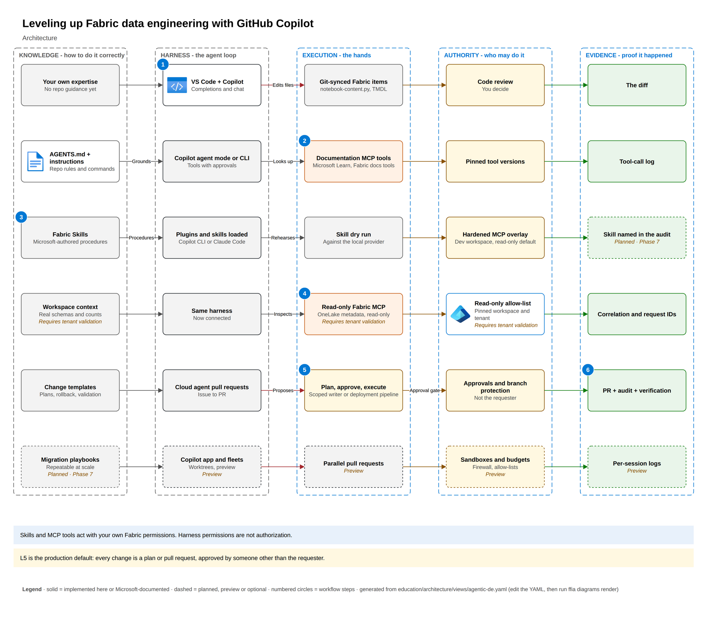
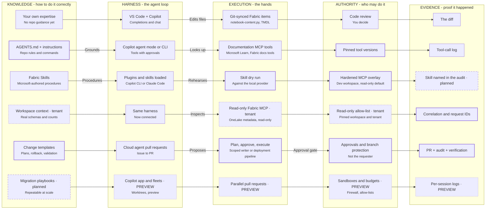

# Leveling up Fabric data engineering with GitHub Copilot

The maturity ladder from Phase 0, drawn as five columns that fill in one level at a time:

- **Knowledge:** how to do it correctly.
- **Harness:** the agent loop.
- **Execution:** the hands.
- **Authority:** who may do it.
- **Evidence:** proof it happened.

Claude Code follows the same ladder; see the *Copilot vs Claude Code* lesson.

## Architecture

<!-- BEGIN GENERATED DIAGRAM: run `ffia diagrams render`; do not edit by hand -->

> Generated from [`education/architecture/views/agentic-de.yaml`](../../education/architecture/views/agentic-de.yaml). Edit the YAML, then run `ffia diagrams render`.

- **draw.io:** [diagrams/agentic-de.drawio](diagrams/agentic-de.drawio). Open it in draw.io desktop, diagrams.net or the VS Code Draw.io Integration extension. Page 1 is the full architecture; the next pages build it up one step at a time.
- **Interactive:** run `make run`, then open `http://localhost:5173/architecture/agentic-de` to build it step by step, trace requests, switch Executive to L400 and see live runtime state.

Solid boxes are implemented here or documented by Microsoft; dashed boxes are planned, preview or optional.

### Workflow

*PLANNED FLOW.* One task - add a Silver table - done at each level, and what each level adds.

1. L1 - Copilot suggests the PySpark; you check it against what you remember.
2. L2 - documentation tools confirm the correct Delta and notebook patterns.
3. L3 - a Fabric Skill supplies the Microsoft-authored procedure and its gotchas.
4. L4 - read-only tools check the real Bronze schema and row counts.
5. L5 - the change becomes a plan or pull request; someone else approves; the writer applies it.
6. The pull request, audit trail and verification are the evidence a reviewer can trust.

### Components

| Component | Status | Role | In this repository |
|---|---|---|---|
| Your own expertise | Microsoft-documented | At L1 the agent relies on general training and what you type. Plausible but wrong Fabric APIs are the main risk. | - |
| VS Code + Copilot | Microsoft-documented | Inline completions and chat on notebook-content.py, SQL, M and DAX files. | - |
| Git-synced Fabric items | Microsoft-documented | Fabric Git integration stores items as files, so they can be edited and reviewed like code. | - |
| Code review | Microsoft-documented | The developer reviews every suggestion before committing. | - |
| The diff | Microsoft-documented | The commit diff is the only evidence at this level. | - |
| AGENTS.md + instructions | Implemented in this repository | Repository instructions read by Copilot and Claude Code - conventions, commands, safety and evidence rules. | `AGENTS.md` |
| Copilot agent mode or CLI | Microsoft-documented | The agent can call tools, each with an approval prompt or an explicit allow rule. | - |
| Documentation MCP tools | Microsoft-documented | Item definitions, API specifications and best practices without any tenant access. | - |
| Pinned tool versions | Implemented in this repository | External servers are pinned so behavior does not change underneath you. | `.mcp.json` |
| Tool-call log | Microsoft-documented | The harness records which tools were called with which inputs. | - |
| Fabric Skills | Microsoft-documented | Skills are knowledge, not execution; they drive REST, SQL, KQL or PySpark under the user's identity. | - |
| Plugins and skills loaded | Microsoft-documented | Skills are installed through the plugin marketplace and loaded on demand when a task matches. | - |
| Skill dry run | Implemented in this repository | Read-only, allow-listed operations over synthetic Parquet; never presented as Fabric. | - |
| Hardened MCP overlay | Implemented in this repository | MCP profiles as code: read-only defaults with explicit tool allow-lists, a separate opt-in authoring profile with per-call approval, and a check that rejects unpinned servers, write tools in read-only profiles and arbitrary query or data-egress tools. | `config/mcp/profiles.yaml` |
| Skill named in the audit | Planned (Phase 7) | Each call records which skill drove it, so reviewers can trace procedure to outcome. | - |
| Workspace context | Requires tenant validation | What the agent learns by inspecting the actual workspace. Must be validated in your tenant. | - |
| Same harness | Microsoft-documented | The same agent, now with read-only access to a real workspace. | - |
| Read-only Fabric MCP | Requires tenant validation | Pick the narrowest server; they run with the caller's Fabric permissions; status differs by server. | `config/mcp/profiles.yaml` |
| Read-only allow-list | Requires tenant validation | Only read tools are allowed, and the workspace and tenant are pinned so the agent cannot wander. | `config/mcp/profiles.yaml` |
| Correlation and request IDs | Implemented in this repository | Records share a correlation ID across plan, approval, execution and tool calls. | - |
| Change templates | Implemented in this repository | Policy defines each operation's risk, validation and rollback, so every plan is complete. | `config/policies/writes.yaml` |
| Cloud agent pull requests | Microsoft-documented | Well-scoped issues become pull requests that humans review. | - |
| Plan, approve, execute | Implemented in this repository | Least-privilege identity bound to specific targets; LIVE writes are never redirected to LOCAL. | `src/fabric_foundry_accelerator/services/changes.py` |
| Approvals and branch protection | Implemented in this repository | Separation of duties, expiry and destination binding protect the decision. | - |
| PR + audit + verification | Implemented in this repository | Records share a correlation ID across plan, approval, execution and tool calls. | - |
| Migration playbooks | Planned (Phase 7) | Procedures that many parallel sessions can follow consistently. | - |
| Copilot app and fleets | Preview | Parallel sessions in isolated worktrees or the cloud. Technical preview. | - |
| Parallel pull requests | Preview | Many small, reviewable changes instead of one large one. | - |
| Sandboxes and budgets | Preview | Limits on what each session can reach and spend. | - |
| Per-session logs | Preview | Every session leaves its own trail and pull request. | - |

### Aligned to

- [GitHub Copilot CLI is now generally available](https://github.blog/changelog/2026-02-25-github-copilot-cli-is-now-generally-available/) (GA)
- [Support for different types of custom instructions](https://docs.github.com/en/copilot/reference/custom-instructions-support) (GA)
- [Skills for Fabric overview](https://learn.microsoft.com/fabric/fundamentals/skills-for-fabric-overview) (OSS)
- [Fabric MCP Server (local) tools reference](https://learn.microsoft.com/rest/api/fabric/articles/mcp-servers/pro-dev-local/tools-local-mcp-server) (GA)
- [Fabric Git integration overview](https://learn.microsoft.com/fabric/cicd/git-integration/intro-to-git-integration) (GA)
- [Extend Claude with skills](https://code.claude.com/docs/en/skills) (GA)

<!-- END GENERATED DIAGRAM -->

## How to use it

- Present it in the app, building one level per click. The speaker cue explains what each level
  adds, its value, its risk and the control it needs.
- L5 (governed change) is the production default. L6 is preview-heavy; keep it to controlled
  experiments.
- Measure each climb with the scorecard: time, steps, approvals requested, checks passed,
  evidence completeness and errors caught. Results are observations on synthetic work, not
  product benchmarks.
