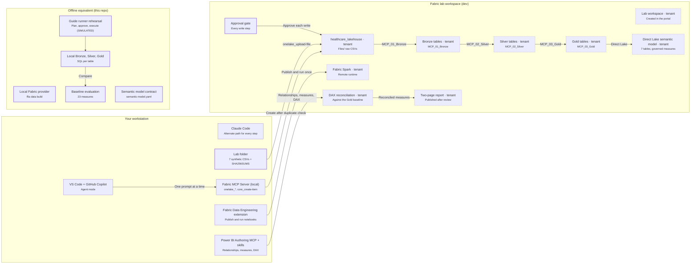

# Guide HC-01 architecture

What each step of Guide HC-01 touches, in the tenant and offline. In the guide runner, each step
highlights its part of this diagram.

## Architecture

<!-- BEGIN GENERATED DIAGRAM: run `ffia diagrams render`; do not edit by hand -->

> Generated from [`education/architecture/views/hc-01.yaml`](../../education/architecture/views/hc-01.yaml). Edit the YAML, then run `ffia diagrams render`.

- **draw.io:** [diagrams/hc-01.drawio](diagrams/hc-01.drawio). Open it in draw.io desktop, diagrams.net or the VS Code Draw.io Integration extension. Page 1 is the full architecture; the next pages build it up one step at a time.
- **Interactive:** run `make run`, then open `http://localhost:5173/architecture/hc-01` to build it step by step, trace requests, switch Executive to L400 and see live runtime state.

Solid boxes are implemented here or documented by Microsoft; dashed boxes are planned, preview or optional.

### Workflow

*PLANNED FLOW.* The fifteen working steps of HC-01 in order, with the tool used at each one.

1. Steps 01-02 - verify the tools, then make one real read-only call to prove the tenant. Claude Code can follow every step with its own prompt.
2. Every cloud step names the provider, server and tool before it runs.
3. Step 04 - create healthcare_lakehouse only after a duplicate check, and only after approval.
4. Step 05 - upload the seven CSVs and confirm checksums.
5. Steps 07-08 - draft, review, publish and run the Bronze notebook once.
6. Step 09 - Silver with documented diagnostics.
7. Step 10 - Gold at a declared grain.
8. Steps 11-13 - the Direct Lake model, relationships and measures, then a read-only review.
9. DAX results are reconciled against the Gold baseline.
10. Step 14 - build, review and publish the report. Step 15 - final validation with evidence.

### Flow: Rehearse offline

*SIMULATED.* The same journey with no tenant - every write rehearsed, every number checked.

1. ffia data build creates the same Bronze, Silver and Gold locally.
2. The guide runner rehearses each write with real policy and approval rules (SIMULATED).
3. Inspect the SQL behind each table.
4. All 23 measures are compared with the expected baseline.

### Components

| Component | Status | Role | In this repository |
|---|---|---|---|
| VS Code + GitHub Copilot | Microsoft-documented | Harnesses provide the agent loop and permissions; AGENTS.md, .mcp.json and .claude/skills are shared by both. | - |
| Claude Code | Microsoft-documented | Every HC-01 step has an equivalent Claude Code prompt using the same MCP servers and instructions. | - |
| Lab folder | Implemented in this repository | ffia data export copies the hc-lab-7file-v1 profile and checksums into a separate lab folder. | `data/synthetic` |
| Fabric MCP Server (local) | Microsoft-documented | The local Fabric MCP server. The guide requires calling its tools directly - no substitution with REST or CLI. | - |
| Fabric Data Engineering extension | Microsoft-documented | VS Code extension used to publish reviewed notebooks and run them on the Microsoft Fabric Runtime kernel. | - |
| Power BI Authoring MCP + skills | Microsoft-documented | Edits the semantic model and runs DAX checks. Write-capable - changes are proposed, reviewed and applied after approval. | - |
| Lab workspace | Requires tenant validation | A dedicated dev workspace for the lab. Its ID stays in local notes only. | - |
| healthcare_lakehouse | Requires tenant validation | Lakehouses in OneLake hold each layer; notebooks transform; tests check row counts and baselines. | - |
| Bronze tables | Requires tenant validation | Raw data persisted as Delta with ingestion metadata. Counts must match the source profile. | - |
| Silver tables | Requires tenant validation | Cleaned and conformed tables with documented diagnostics (duplicates, invalid values, orphans). | - |
| Gold tables | Requires tenant validation | Star-schema facts and dimensions at a declared grain, reconciled against the expected baseline. | - |
| Fabric Spark | Requires tenant validation | Notebooks run once each on the Fabric Spark runtime; per-table counts are the evidence. | - |
| Direct Lake semantic model | Requires tenant validation | Direct Lake reads Gold Delta tables; measures are the governed definitions agents should reuse. | - |
| DAX reconciliation | Requires tenant validation | Every measure is checked against the expected values in data/synthetic/expected - evidence, not appearance. | - |
| Two-page report | Requires tenant validation | An executive overview and a population page bound to the validated model. A local PBIR file is not publication. | - |
| Approval gate | Implemented in this repository | Separation of duties, expiry and destination binding protect the decision. | - |
| Local Fabric provider | Implemented in this repository | Read-only, allow-listed operations over synthetic Parquet; never presented as Fabric. | - |
| Guide runner rehearsal | Implemented in this repository | The guide runner rehearses each write step against the simulated workspace with the real policy and approval rules. | `frontend/src/features/guides` |
| Local Bronze, Silver, Gold | Implemented in this repository | The same medallion built locally with DuckDB, one SQL file per output table. | `src/fabric_foundry_accelerator/synthetic/sql` |
| Baseline evaluation | Implemented in this repository | Deterministic baselines for data; model-graded evaluators for language quality. | - |
| Semantic model contract | Implemented in this repository | Tables, relationships and measure contracts with reference DAX for the hc-lab-7file-v1 profile. | `data/synthetic/semantic` |

### Aligned to

- [Implement medallion lakehouse architecture in Microsoft Fabric](https://learn.microsoft.com/fabric/onelake/onelake-medallion-lakehouse-architecture) (GUIDANCE)
- [Direct Lake overview](https://learn.microsoft.com/fabric/fundamentals/direct-lake-overview) (GA)
- [Fabric MCP Server (local) tools reference](https://learn.microsoft.com/rest/api/fabric/articles/mcp-servers/pro-dev-local/tools-local-mcp-server) (GA)
- [Power BI Authoring (Modeling) MCP server](https://learn.microsoft.com/power-bi/developer/mcp/power-bi-authoring-mcp) (GA)
- [Fabric Git integration overview](https://learn.microsoft.com/fabric/cicd/git-integration/intro-to-git-integration) (GA)

<!-- END GENERATED DIAGRAM -->

## Deployment pattern

The lab uses **one dedicated dev workspace**, which corresponds to Fabric deployment pattern 1
(monolithic). The medallion guidance also recommends a workspace per layer for governance at
scale. Both are valid; the lab keeps one workspace so the steps stay simple.
