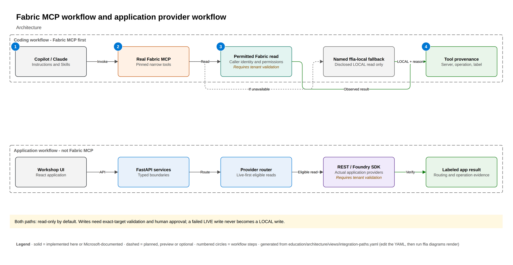
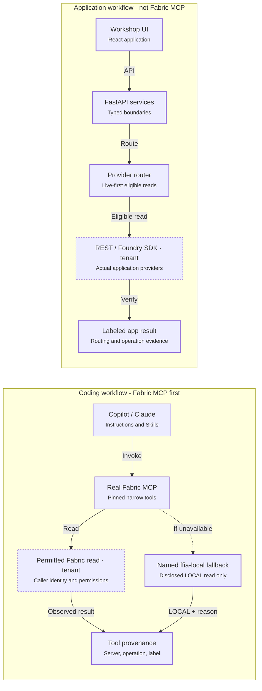

# Two integration paths, two kinds of evidence

The real Microsoft Fabric MCP server can run locally while accessing live Fabric. It is not
the synthetic `ffia-local` server. The `fabric-first` profile and repository instructions
guide selection; configuration does not automatically invoke a tool or prove execution.

The application provider router uses Fabric REST and Foundry SDK adapters. Its live evidence
cannot certify a guide-assigned MCP step. Reads can use disclosed approved fallback; failed
live writes stop, with any simulated rehearsal planned separately.

<!-- BEGIN GENERATED DIAGRAM: run `ffia diagrams render`; do not edit by hand -->

> Generated from [`education/architecture/views/integration-paths.yaml`](../../education/architecture/views/integration-paths.yaml). Edit the YAML, then run `ffia diagrams render`.

- **draw.io:** [diagrams/integration-paths.drawio](diagrams/integration-paths.drawio). Open it in draw.io desktop, diagrams.net or the VS Code Draw.io Integration extension. Page 1 is the full architecture; the next pages build it up one step at a time.
- **Interactive:** run `make run`, then open `http://localhost:5173/architecture/integration-paths` to build it step by step, trace requests, switch Executive to L400 and see live runtime state.

Solid boxes are implemented here or documented by Microsoft; dashed boxes are planned, preview or optional.

### Workflow

*LOCAL.* LOCAL explanation of the assigned tool path; this trace does not invoke its tools.

1. Instructions and Skills guide artifact preparation and reviewed tool use.
2. Discover and invoke the designated real Fabric MCP tool.
3. Caller identity and permissions constrain the read.
4. Record actual server, operation, result label and limitations.

### Flow: Unavailable MCP read has a named fallback

*LOCAL.* LOCAL explanation of disclosed read fallback, never write redirection.

1. Report the primary tool's unavailability explicitly.
2. Offer only the designated ffia-local read equivalent.
3. Label the result LOCAL and preserve the fallback reason.

### Flow: Application uses REST and SDK providers

*LOCAL.* LOCAL explanation of application routing, not proof of an MCP invocation.

1. The browser calls the typed application API.
2. Services own domain behavior and depend on provider ports.
3. Select an eligible read under the live-first policy.
4. Fabric REST or Foundry SDK performs the bounded operation.
5. Retain routing and execution evidence without claiming MCP certification.

### Components

| Component | Status | Role | In this repository |
|---|---|---|---|
| Copilot / Claude | Microsoft-documented | The coding harness proposes artifacts and invokes the designated tool under review. Claude remains documented-only in the bake-off. | - |
| Real Fabric MCP | Microsoft-documented | The Microsoft server can run locally and access live Fabric. Profile configuration does not prove tool execution. | - |
| Permitted Fabric read | Requires tenant validation | An actual tool invocation obtains observed context when available. | - |
| Named ffia-local fallback | Implemented in this repository | Offer only after reporting primary-tool unavailability. A failed live write stops; a rehearsal is separately SIMULATED. | - |
| Tool provenance | Implemented in this repository | Retain actual tool results and limitations. Do not infer execution from configuration. | - |
| Workshop UI | Implemented in this repository | The browser uses the typed application API without holding cloud credentials. | - |
| FastAPI services | Implemented in this repository | Routes call services; domain logic lives behind provider ports. | - |
| Provider router | Implemented in this repository | Apply bounded retries, circuit breaker and approved fallback policy. | - |
| REST / Foundry SDK | Requires tenant validation | The application path calls Fabric REST and Foundry SDK adapters, not the guide's Fabric MCP tools. | - |
| Labeled app result | Implemented in this repository | An application LIVE or PREVIEW result certifies only its bounded observed operation, never an MCP call or publication. | - |

### Aligned to

- [Fabric MCP Server (local) tools reference](https://learn.microsoft.com/rest/api/fabric/articles/mcp-servers/pro-dev-local/tools-local-mcp-server) (GA)
- [Foundry Agent Service overview](https://learn.microsoft.com/azure/foundry/agents/overview) (GA)
- [Fabric REST API identity support](https://learn.microsoft.com/rest/api/fabric/articles/identity-support) (GA)

<!-- END GENERATED DIAGRAM -->
