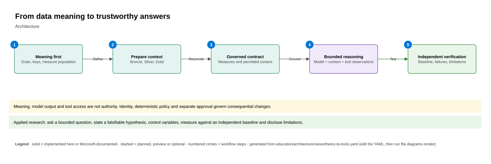

# From foundations to today's tools

Use this focused map before the full architecture. Explain the conceptual role of each box,
then use the [foundation lessons](../../education/architecture/) and their research lenses to
test assumptions. This is not a claim of direct product lineage or live execution.

<!-- BEGIN GENERATED DIAGRAM: run `ffia diagrams render`; do not edit by hand -->

> Generated from [`education/architecture/views/theory-to-tools.yaml`](../../education/architecture/views/theory-to-tools.yaml). Edit the YAML, then run `ffia diagrams render`.

- **draw.io:** [diagrams/theory-to-tools.drawio](diagrams/theory-to-tools.drawio). Open it in draw.io desktop, diagrams.net or the VS Code Draw.io Integration extension. Page 1 is the full architecture; the next pages build it up one step at a time.
- **Interactive:** run `make run`, then open `http://localhost:5173/architecture/theory-to-tools` to build it step by step, trace requests, switch Executive to L400 and see live runtime state.

```mermaid
flowchart LR
  meaning["Meaning first<br/><small>Grain, keys, measure population</small>"]
  layers["Prepare context<br/><small>Bronze, Silver, Gold</small>"]
  contract["Governed contract<br/><small>Measures and permitted context</small>"]
  reasoning["Bounded reasoning<br/><small>Model + context + tool observations</small>"]
  verify["Independent verification<br/><small>Baseline, failures, limitations</small>"]
  meaning -->|Define| layers
  layers -->|Reconcile| contract
  contract -->|Ground| reasoning
  reasoning -->|Test| verify
  class meaning,layers,contract,reasoning documented
  class verify implemented
  classDef implemented stroke-width:2px
  classDef planned stroke-dasharray: 6 4
  classDef preview stroke-dasharray: 2 3
  classDef optional stroke-dasharray: 8 4
  classDef documented stroke-width:1px
  classDef tenant_validation stroke-dasharray: 3 3
```

Solid boxes are implemented here or documented by Microsoft; dashed boxes are planned, preview or optional.

### Workflow

*LOCAL.* A LOCAL explanation of conceptual connections, not a cloud operation or product lineage claim.

1. Agree on grain, keys and the measure population.
2. Prepare reproducible context while preserving source provenance.
3. Expose stable meaning under the caller's permitted scope.
4. Reason over returned context and actual tool observations.
5. Check independently and retain failures and limitations.

### Components

| Component | Status | Role | In this repository |
|---|---|---|---|
| Meaning first | Microsoft-documented | Relational abstractions define what a record and operation mean, independently of physical representation. | - |
| Prepare context | Microsoft-documented | Preserve provenance, apply reviewed quality rules and create reproducible serving data. | - |
| Governed contract | Microsoft-documented | Reusable semantic meaning and identity determine the context a consumer may use. | - |
| Bounded reasoning | Microsoft-documented | Retrieved or queried context and observed tool results support reasoning, but do not guarantee correctness. | - |
| Independent verification | Implemented in this repository | Compare answers with deterministic synthetic expected results and retain adverse cases. | - |

### Aligned to

- [A relational model of data for large shared data banks](https://research.ibm.com/publications/a-relational-model-of-data-for-large-shared-data-banks) (GUIDANCE)
- [Retrieval-Augmented Generation for Knowledge-Intensive NLP Tasks](https://arxiv.org/abs/2005.11401) (GUIDANCE)
- [ReAct: Synergizing Reasoning and Acting in Language Models](https://arxiv.org/abs/2210.03629) (GUIDANCE)
- [Implement medallion lakehouse architecture in Microsoft Fabric](https://learn.microsoft.com/fabric/onelake/onelake-medallion-lakehouse-architecture) (GUIDANCE)

<!-- END GENERATED DIAGRAM -->
