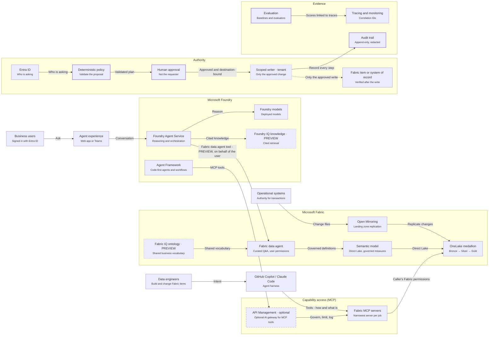

# Fabric + Foundry reference architecture

This architecture shows how Microsoft Fabric and Microsoft Foundry divide the work:

- Fabric provides governed business context.
- Foundry turns that context into reasoning, orchestration, evaluation and action.
- MCP standardizes capability access, but it does not grant authority.
- Entra identity and deterministic policy decide what is allowed.
- Every hop produces evidence.

> **No single first-party Fabric + Foundry reference architecture exists yet** in the Azure
> Architecture Center (verified 2026-10-07). This architecture combines the published guidance
> listed under *Aligned to*. The closest first-party framing is the Cloud Adoption Framework's
> *Data architecture for AI agents*: OneLake data products consumed by agents through Fabric IQ
> and Foundry IQ.

## Architecture

<!-- BEGIN GENERATED DIAGRAM: run `ffia diagrams render`; do not edit by hand -->

> Generated from [`education/architecture/views/reference.yaml`](../../education/architecture/views/reference.yaml). Edit the YAML, then run `ffia diagrams render`.

- **draw.io:** [diagrams/reference.drawio](diagrams/reference.drawio). Open it in draw.io desktop, diagrams.net or the VS Code Draw.io Integration extension. Page 1 is the full architecture; the next pages build it up one step at a time.
- **Interactive:** run `make run`, then open `http://localhost:5173/architecture/reference` to build it step by step, trace requests, switch Executive to L400 and see live runtime state.

Solid boxes are implemented here or documented by Microsoft; dashed boxes are planned, preview or optional.

### Workflow

*PLANNED FLOW.* A business user asks a question; the answer comes from governed Fabric definitions under the user's own permissions.

1. A user asks a question in the agent experience. Signed in with Entra ID.
2. The app passes the conversation to the Foundry agent. The app holds no data permissions of its own.
3. The agent decides it needs governed numbers, not a guess.
4. It asks the Fabric data agent on behalf of the user. The Foundry Fabric data agent tool is in preview and uses the user's identity.
5. The data agent answers from the semantic model's governed measures.
6. Direct Lake reads Gold tables in OneLake. Fabric permissions filter what this user may see.
7. The agent composes the answer with its sources.
8. Evaluations score groundedness and correctness against expected answers. Offline, Act 6 of the demo is UNAVAILABLE until Phase 6 - nothing is simulated as Foundry.

### Flow: Make a governed change

*SIMULATED.* An agent proposes a change; policy validates, a person approves, and only the scoped writer executes. Offline demo act 5.

1. The agent proposes a change, for example a new lakehouse. Model intent is not proof of authorization.
2. Deterministic policy checks the operation, workspace, duplicates and risk.
3. A different person approves. Self-approval is refused and audited.
4. Only the scoped writer executes, and only the approved, destination-bound change.
5. The writer verifies the result against the target. Offline this is a simulated workspace labeled SIMULATED. An approved LIVE change is never redirected to it.
6. Every step is in the audit trail under one correlation ID.

### Flow: Engineer with a coding agent

*PLANNED FLOW.* An engineer uses GitHub Copilot or Claude Code; MCP gives access to docs and context, and changes still go through review and approval.

1. An engineer asks the coding agent to design or fix a pipeline.
2. The harness loads repo instructions and skills - the knowledge to do it correctly.
3. It uses the narrowest MCP server - docs for how, read-only tools for what is.
4. Reads run with the engineer's own Fabric permissions.
5. Any change becomes a plan or a pull request, never a direct write.
6. A reviewer approves before anything is applied.

### Components

| Component | Status | Role | In this repository |
|---|---|---|---|
| Business users | Microsoft-documented | People asking questions of governed data through an agent experience. They act with their own identity. | - |
| Data engineers | Microsoft-documented | Engineers who build pipelines, notebooks and semantic models, increasingly with an AI coding agent. | - |
| Agent experience | Microsoft-documented | The user-facing chat or app that hosts the agent conversation. In the Microsoft baseline Foundry chat architecture this is a web app behind a web application firewall, calling Foundry Agent Service with a managed identity. | - |
| GitHub Copilot / Claude Code | Microsoft-documented | Harnesses provide the agent loop and permissions; AGENTS.md, .mcp.json and .claude/skills are shared by both. | - |
| Foundry models | Microsoft-documented | Models deployed in a Foundry project that the agent uses to reason. Model choice and deployment are Foundry concerns, not Fabric ones. | - |
| Foundry Agent Service | Microsoft-documented | Owns reasoning and orchestration; consumes Fabric context; never performs authoritative writes directly. | - |
| Foundry IQ knowledge | Preview | Knowledge bases that ground the agent in documents with citations, including files in OneLake. Some experiences are in preview. | - |
| Agent Framework | Microsoft-documented | Runs locally or against Foundry; supports workflows, tools and human-in-the-loop steps. | - |
| API Management | Optional | Adds authentication, rate limits, logging and policies in front of MCP servers and model endpoints. | - |
| Fabric MCP servers | Microsoft-documented | Pick the narrowest server; they run with the caller's Fabric permissions; status differs by server. | - |
| Fabric IQ ontology | Preview | Gives many consumers one model of the business without copying data. | - |
| Fabric data agent | Microsoft-documented | Uses the end user's identity; Fabric permissions decide what is visible. | - |
| Semantic model | Microsoft-documented | Direct Lake reads Gold Delta tables; measures are the governed definitions agents should reuse. | - |
| OneLake medallion | Microsoft-documented | Lakehouses in OneLake hold each layer; notebooks transform; tests check row counts and baselines. | - |
| Open Mirroring | Microsoft-documented | Snapshot plus incremental files; processed files are cleaned up after seven days. | - |
| Operational systems | Microsoft-documented | The business systems that own transactional truth. Analytics and agents read replicated copies; writes go back only through an approved, scoped path. | - |
| Entra ID | Microsoft-documented | User, approver and writer are different identities; agents act on behalf of users or as scoped identities. | - |
| Deterministic policy | Implemented in this repository | Policy files define operations, risk and rollback; overlays can narrow but not remove approval. | `config/policies/writes.yaml` |
| Human approval | Implemented in this repository | Separation of duties, expiry and destination binding protect the decision. | `src/fabric_foundry_accelerator/services/changes.py` |
| Scoped writer | Requires tenant validation | Least-privilege identity bound to specific targets; LIVE writes are never redirected to LOCAL. | `src/fabric_foundry_accelerator/providers/fabric/writer.py` |
| Fabric item or system of record | Microsoft-documented | The target of an approved change. The writer verifies the result against it, and the audit trail records the outcome. | - |
| Tracing and monitoring | Microsoft-documented | Structured logs with correlation IDs locally; traces in a monitoring service in production. | - |
| Evaluation | Implemented in this repository | Deterministic baselines for data; model-graded evaluators for language quality. | `src/fabric_foundry_accelerator/services/evaluation.py` |
| Audit trail | Implemented in this repository | Records share a correlation ID across plan, approval, execution and tool calls. | `src/fabric_foundry_accelerator/audit/store.py` |

### Aligned to

- [Data architecture for AI agents across your organization](https://learn.microsoft.com/azure/cloud-adoption-framework/ai-agents/data-architecture-plan) (GUIDANCE)
- [Basic Microsoft Foundry chat reference architecture](https://learn.microsoft.com/azure/architecture/ai-ml/architecture/basic-microsoft-foundry-chat) (GUIDANCE)
- [Baseline Microsoft Foundry chat reference architecture](https://learn.microsoft.com/azure/architecture/ai-ml/architecture/baseline-microsoft-foundry-chat) (GUIDANCE)
- [Implement medallion lakehouse architecture in Microsoft Fabric](https://learn.microsoft.com/fabric/onelake/onelake-medallion-lakehouse-architecture) (GUIDANCE)
- [Microsoft Fabric deployment patterns](https://learn.microsoft.com/azure/architecture/data-guide/technology-choices/fabric-deployment-patterns) (GUIDANCE)
- [Azure Well-Architected Framework service guide for Microsoft Fabric](https://learn.microsoft.com/azure/well-architected/microsoft-fabric/overview) (GUIDANCE)
- [Use the Microsoft Fabric data agent tool in Foundry Agent Service](https://learn.microsoft.com/azure/foundry/agents/how-to/tools/fabric) (PREVIEW)
- [Choose a Microsoft Fabric MCP server](https://learn.microsoft.com/rest/api/fabric/articles/mcp-servers/fabric-mcp-servers-list) (GUIDANCE)
- [Overview of MCP servers in Azure API Management](https://learn.microsoft.com/azure/api-management/mcp-server-overview) (GA)
- [Govern MCP tools by using an AI gateway (Microsoft Foundry)](https://learn.microsoft.com/azure/foundry/agents/how-to/tools/governance) (PREVIEW)
- [AI agent orchestration patterns](https://learn.microsoft.com/azure/architecture/ai-ml/guide/ai-agent-design-patterns) (GUIDANCE)

<!-- END GENERATED DIAGRAM -->

## Scenario details

Use this architecture when people or agents need answers or actions grounded in governed
analytical data. Examples include operational analytics, claims or encounter trends, and
capacity planning, where the semantic model already defines the business measures.

**Potential use cases**

- Conversational questions over curated lakehouse, warehouse or semantic-model data (P01).
- Agents that must answer only within each user's data permissions (on-behalf-of).
- AI-assisted data engineering with governed change (P19–P24).

**When not to use it**

- A fixed report already answers the question.
- The data is not yet governed. Fix the medallion and semantic layers first.
- Only service-principal access is possible. The Foundry Fabric data agent tool requires user
  identity.

## Alternatives

- **Direct model call or a single agent with tools.** The Azure Architecture Center's AI agent
  orchestration guidance recommends the lowest complexity that reliably works. A single agent
  with tools is often the right default (P13: multi-domain is not multi-agent).
- **Copilot in Fabric or a Fabric data agent on its own.** Use these when the built-in experience
  fits. Add Foundry only when you need a custom application, model choice or tools beyond the
  built-in experience.
- **Foundry IQ over OneLake files (P04)** for document questions, with governed measures for
  numeric questions.

## Considerations

These considerations follow the Azure Well-Architected Framework pillars.

### Reliability

- Design for a dependency being unavailable. The accelerator's router applies timeouts, bounded
  retries and a circuit breaker per capability.
- Reads may fall back to an approved equivalent, with a visible label. Writes never fall back.
  See [live-vs-offline.md](live-vs-offline.md).
- Fabric reliability uses capacities, data replication and failover strategies (Well-Architected
  guide for Fabric).

### Security

- Identity is the primary control:
  - users act through Entra ID;
  - the Fabric data agent uses the user's identity;
  - services use managed identities.
- MCP access and gateway policy never replace authorization in Fabric or in the MCP server.
- Every write follows PLAN → VALIDATE → APPROVE → EXECUTE → VERIFY → AUDIT, with separation of
  duties and a narrowly scoped writer.
- For network isolation, egress control and private endpoints, see
  [production-architecture.md](production-architecture.md).

### Cost Optimization

- Size Fabric capacity to its workloads, and keep heavy engineering jobs away from interactive
  queries.
- The Foundry Fabric data agent tool needs an F2 or higher capacity (or Power BI Premium P1 or
  higher with Fabric enabled).
- Prefer built-in retrieval before building custom MCP servers.

### Operational Excellence

- Keep definitions in Git (Fabric Git integration, PBIP/TMDL) and promote them through
  deployment pipelines.
- Evaluate continuously against baselines. Correlate traces, evaluations and audit records with
  one correlation ID.

### Performance Efficiency

- Serve Gold through Direct Lake and governed measures, instead of having agents generate ad-hoc
  SQL over raw tables.
- Keep Bronze immutable, and optimize Silver and Gold for reads.

## Related

- [production-architecture.md](production-architecture.md): the same architecture on the
  Foundry baseline.
- [system-architecture.md](system-architecture.md): how this repository implements it locally.
- [mcp-topology.md](mcp-topology.md) and
  [agentic-data-engineering.md](agentic-data-engineering.md).
