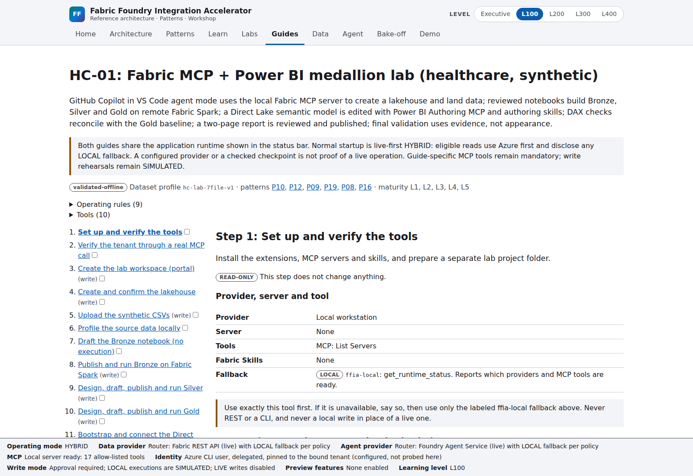
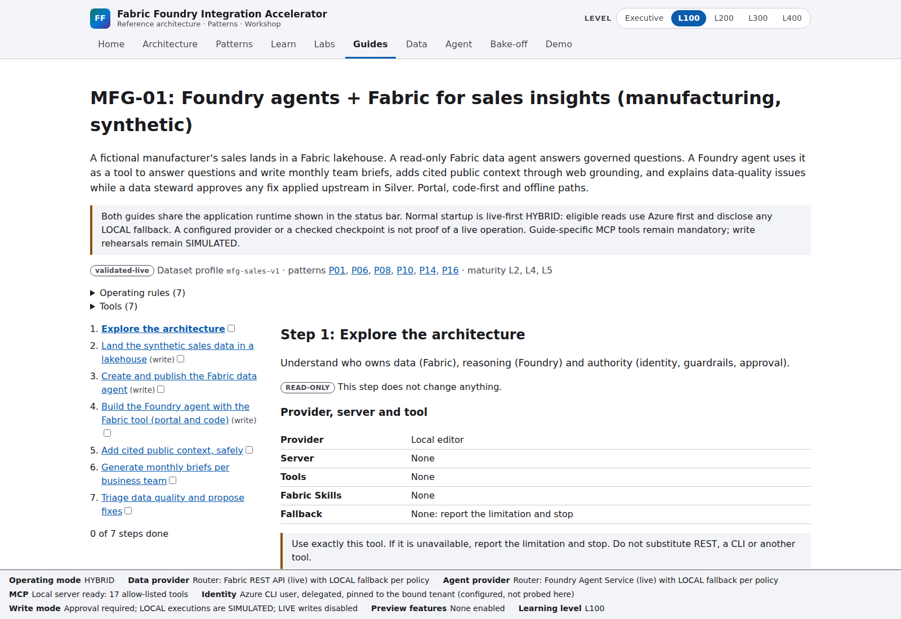

# How this repository works

**Fabric = governed context. Foundry = reasoning. MCP = capability access.
Entra + policy + human approval = authority.**

The PNG was exported locally by draw.io Desktop, not rasterized from the app's SVG.
The [draw.io source](diagrams/system.drawio) remains editable, and the PNG embeds the exported
architecture page.
See the [diagram export instructions](diagrams/README.md) for every view and the reproducible
export command. These are static architecture illustrations, not proof of cloud execution.

## Follow a request

| Start / component | Repository location | What happens |
|---|---|---|
| Browser, both guides | [frontend](../../frontend/src/features/guides/), [guide manifests](../../guides/) | Structured lessons, tool paths, prompts and checkpoints; shared runtime status |
| CLI / API | [CLI](../../src/fabric_foundry_accelerator/cli.py), [API](../../src/fabric_foundry_accelerator/api/) | Validate input and invoke services; browser never holds cloud credentials |
| Composition and configuration | [container](../../src/fabric_foundry_accelerator/services/container.py), [settings](../../src/fabric_foundry_accelerator/config/settings.py), [environments](../../config/environments/) | Load private `.env`, resolve bindings, inject ports and policies |
| Live-first read routing | [router](../../src/fabric_foundry_accelerator/fallback/router.py), [providers](../../src/fabric_foundry_accelerator/providers/fabric/) | LIVE read first; timeout/retry/breaker; approved LOCAL read fallback with reason |
| Governed context | [synthetic data](../../data/synthetic/), [notebooks](../../notebooks/), [Power BI](../../powerbi/) | Bronze/Silver/Gold and semantic meaning; LOCAL analog or actual Fabric provider |
| Foundry reasoning | [agents](../../src/fabric_foundry_accelerator/agents/), [evaluation](../../src/fabric_foundry_accelerator/evaluation/) | Existing-agent Responses SDK; PREVIEW Fabric tool; deterministic comparison; draft/review, not automatic delivery |
| Governed changes | [change service](../../src/fabric_foundry_accelerator/services/changes.py), [policies](../../config/policies/) | PLAN → VALIDATE → APPROVE → EXECUTE → VERIFY → AUDIT. Writes never fall back |
| Evidence | [audit](../../src/fabric_foundry_accelerator/audit/), [observability](../../src/fabric_foundry_accelerator/observability/), [tests](../../tests/) | Correlation, labels, routing decisions, tests and explicitly enabled telemetry |
| Coding harnesses | [instructions](../../AGENTS.md), [MCP profiles](../../config/mcp/profiles.yaml), [skills](../../.claude/skills/), [prompts](../../prompts/) | Copilot plans/edits/calls tools; Fabric Skills supply procedures; Fabric MCP supplies actual tools. Claude Code is documented-only |
| Teaching / release | [education](../../education/), [talk tracks](../../demos/), [workflows](../../.github/workflows/) | Executive through L400, demos and local/CI gates; workflows do not deploy cloud resources |

## Two separate integration paths

1. **App:** React → FastAPI → provider router → Fabric REST / Foundry SDK.
   HYBRID reads can fall back to synthetic LOCAL providers.
2. **Guide 1 coding harness:** Copilot + instructions/skills → actual Fabric MCP tools,
   Fabric notebook extension, and Power BI authoring tools. Named `ffia-local` fallback is
   explicitly LOCAL/SIMULATED. App REST results do not prove an MCP tool ran.

## Both guides, live-first UI

Guide 1: Fabric MCP and Fabric Skills improve the engineering workflow; Copilot proposes,
authors and invokes the assigned tools under review. The screenshot proves the guide UI is
running with HYBRID configuration, not that its create/upload/notebook/report steps executed.

Guide 2: Fabric provides the governed sales context, Foundry calls its data agent and reasons
over the result, and business teams receive only reviewed drafts. The UI shares the same
HYBRID runtime as Guide 1. Static lesson content remains LOCAL.

Guide architecture exports: [Guide 1 PNG](diagrams/hc-01.png) /
[draw.io](diagrams/hc-01.drawio), [Guide 2 PNG](diagrams/mfg-01.png) /
[draw.io](diagrams/mfg-01.drawio). Screenshots contain only synthetic app content, never portals,
private environment files or tenant/workspace identifiers.

For actual cloud evidence and remaining limitations, read [phase verification](../operations/phase-verification.md).
