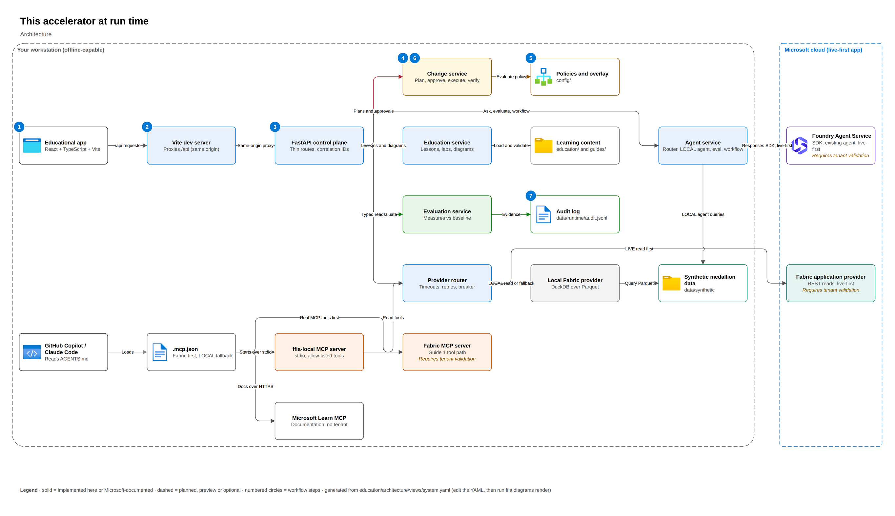
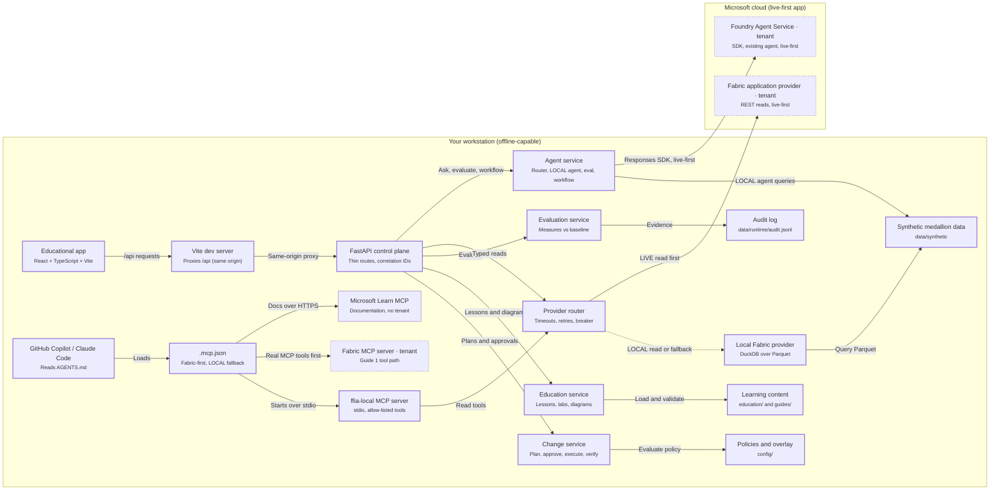

# This accelerator at run time

How the parts of this repository fit together when you run them, and which parts are live right
now. The interactive version includes a **runtime overlay**: each bound box is colored from
`GET /api/v1/education/views/system/runtime`, so the diagram always reflects the actual mode and
providers. Boxes for later phases show as not configured. They are never faked.

## Architecture

<!-- BEGIN GENERATED DIAGRAM: run `ffia diagrams render`; do not edit by hand -->

> Generated from [`education/architecture/views/system.yaml`](../../education/architecture/views/system.yaml). Edit the YAML, then run `ffia diagrams render`.

- **draw.io:** [diagrams/system.drawio](diagrams/system.drawio). Open it in draw.io desktop, diagrams.net or the VS Code Draw.io Integration extension. Page 1 is the full architecture; the next pages build it up one step at a time.
- **Interactive:** run `make run`, then open `http://localhost:5173/architecture/system` to build it step by step, trace requests, switch Executive to L400 and see live runtime state.

Solid boxes are implemented here or documented by Microsoft; dashed boxes are planned, preview or optional.

### Workflow

*SIMULATED.* The HC-01 guide runner rehearses a governed write against the simulated workspace. Offline demo act 5.

1. In the guide runner you press Plan and validate. The browser only shows what the backend decides.
2. The request goes to /api on the same origin.
3. The control plane assigns a correlation ID and calls the change service.
4. The change service records the plan and checks for duplicates.
5. Policy decides whether the operation, item type and workspace alias are allowed.
6. After a different person approves, the scoped writer executes in the simulated workspace and verifies. Labeled SIMULATED. No Fabric item is created.
7. Plan, approvals (including refused ones) and execution are audited under one correlation ID.

### Flow: Read with fallback

*LOCAL.* A read goes through the router; when the live provider fails, the approved LOCAL equivalent answers, visibly labeled. Offline demo act 7.

1. The data explorer asks for the lakehouse tables.
2. The control plane sends a typed read to the router.
3. The router tries the live provider with a timeout and bounded retries. Offline there is no live provider, so it goes straight to LOCAL.
4. The live call fails or the breaker is open (simulated outage in training).
5. The approved LOCAL equivalent answers. The result is labeled LOCAL in HYBRID mode with a fallback reason.
6. Data comes from synthetic Parquet built by ffia data build.

### Flow: A coding agent proposes a plan

*LOCAL.* GitHub Copilot or Claude Code calls ffia-local over MCP. It can read and propose, but never approve or execute. Offline demo act 3.

1. You ask the coding agent to propose a lakehouse change.
2. The harness reads .mcp.json and starts ffia-local.
3. It calls generate_fabric_change_plan. There is no approve or execute tool. MCP access is not authority.
4. Read tools such as preview_table go through the same router, labeled LOCAL.
5. Every tool call is rate limited and audited.

### Components

| Component | Status | Role | In this repository |
|---|---|---|---|
| Educational app | Implemented in this repository | React frontend over a FastAPI control plane; routes stay thin and call services; no credentials in the browser. | `frontend/src` |
| GitHub Copilot / Claude Code | Implemented in this repository | Harnesses provide the agent loop and permissions; AGENTS.md, .mcp.json and .claude/skills are shared by both. | `AGENTS.md` |
| Vite dev server | Implemented in this repository | Serves the app on port 5173 and forwards /api to the control plane, so the browser holds no API host or credentials. | `frontend/vite.config.ts` |
| .mcp.json | Implemented in this repository | VS Code, Copilot CLI and documented-only Claude Code share the pinned Fabric MCP server, Microsoft Learn and ffia-local. These external tool paths are separate from the application's REST provider. | `.mcp.json` |
| FastAPI control plane | Implemented in this repository | The control plane. Routes validate input and call services; errors come back in one problem shape. OpenAPI is exported and the frontend types are generated from it. | `src/fabric_foundry_accelerator/api` |
| ffia-local MCP server | Implemented in this repository | Allow-listed from config/policies/tools.yaml; no approve, execute, shell or SQL tools. | `src/fabric_foundry_accelerator/mcp/server.py` |
| Microsoft Learn MCP | Microsoft-documented | The public Microsoft Learn MCP server used for how-to questions. It needs network access but no tenant or credentials. | - |
| Change service | Implemented in this repository | Separation of duties, expiry and destination binding protect the decision. | `src/fabric_foundry_accelerator/services/changes.py` |
| Education service | Implemented in this repository | Serves validated lessons, labs, the architecture views and the completeness gate. Knowledge-check answers stay on the server. | `src/fabric_foundry_accelerator/services/education.py` |
| Evaluation service | Implemented in this repository | Deterministic baselines for data; model-graded evaluators for language quality. | `src/fabric_foundry_accelerator/services/evaluation.py` |
| Provider router | Implemented in this repository | Timeouts, retries and a circuit breaker per capability; writes never fall back. | `src/fabric_foundry_accelerator/fallback/router.py` |
| Policies and overlay | Implemented in this repository | Policy files define operations, risk and rollback; overlays can narrow but not remove approval. | `config/policies` |
| Learning content | Implemented in this repository | Lessons, labs, architecture views, the pattern catalog and Use-Case Guides as validated YAML and Markdown. | `education` |
| Audit log | Implemented in this repository | Records share a correlation ID across plan, approval, execution and tool calls. | `src/fabric_foundry_accelerator/audit/store.py` |
| Local Fabric provider | Implemented in this repository | Read-only, allow-listed operations over synthetic Parquet; never presented as Fabric. | `src/fabric_foundry_accelerator/providers/fabric/local.py` |
| Synthetic medallion data | Implemented in this repository | Generated synthetic CSVs, built Bronze, Silver and Gold Parquet, semantic model contracts and expected baselines. No real data. | `data/synthetic` |
| Agent service | Implemented in this repository | Asks the sales agent through the provider router: the deterministic LOCAL agent offline, the live Foundry agent when opted in. Also runs the agent evaluation suite and the Agent Framework monthly-insights workflow (drafts only; nothing is sent). | `src/fabric_foundry_accelerator/agents` |
| Foundry Agent Service | Requires tenant validation | Owns reasoning and orchestration; consumes Fabric context; never performs authoritative writes directly. | `src/fabric_foundry_accelerator/agents/foundry.py` |
| Fabric application provider | Requires tenant validation | Pick the narrowest server; they run with the caller's Fabric permissions; status differs by server. | `src/fabric_foundry_accelerator/providers/fabric/live.py` |
| Fabric MCP server | Requires tenant validation | The coding harness calls the actual pinned Fabric MCP tools. If unavailable, announce it and use only the guide's named ffia-local read fallback or SIMULATED write rehearsal. The application REST provider is not MCP evidence. | `config/mcp/profiles.yaml` |

### Aligned to

- [Baseline Microsoft Foundry chat reference architecture](https://learn.microsoft.com/azure/architecture/ai-ml/architecture/baseline-microsoft-foundry-chat) (GUIDANCE)
- [Fabric MCP Server (local) tools reference](https://learn.microsoft.com/rest/api/fabric/articles/mcp-servers/pro-dev-local/tools-local-mcp-server) (GA)
- [Model Context Protocol specification versioning](https://modelcontextprotocol.io/specification/versioning) (GA)

<!-- END GENERATED DIAGRAM -->

## Notes

- **Processes.** The API (`make run-api`) and the local MCP server (`ffia serve mcp`, started by
  each harness from `.mcp.json`) are separate processes. They share configuration, data and the
  JSONL audit log. Plans and approvals live in memory in each process.
- **Contracts.** `ffia schemas export` writes `schemas/openapi.json` and the frontend's generated
  TypeScript types. `ffia schemas check` and `ffia diagrams check` keep contracts and diagrams
  from drifting.
- **Honesty.** Every result is an execution envelope with a label. The Local Fabric Educational
  Provider is not an emulator, and its results never claim to be a cloud operation.

See [control-plane.md](control-plane.md), [frontend.md](frontend.md) and
[resilience.md](resilience.md).
