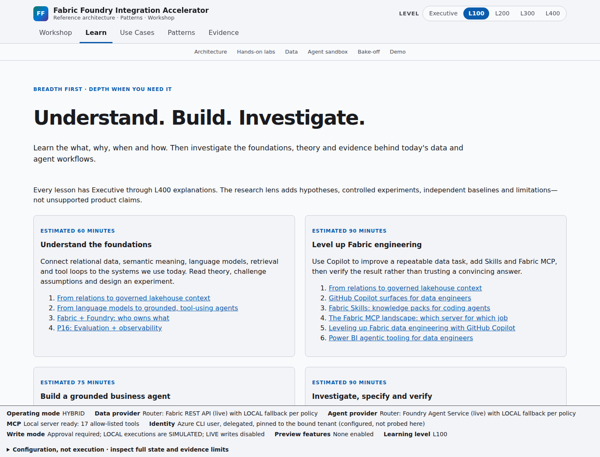
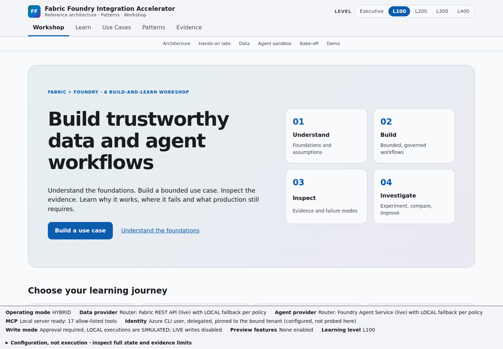
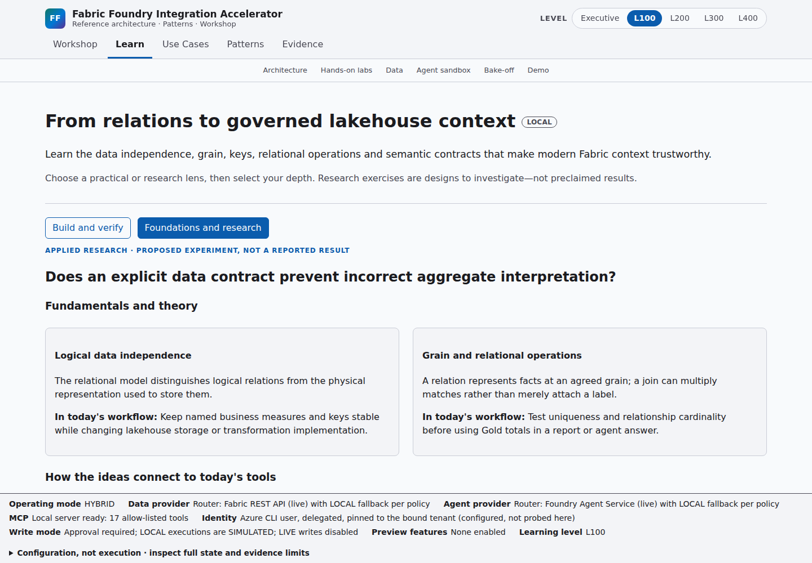
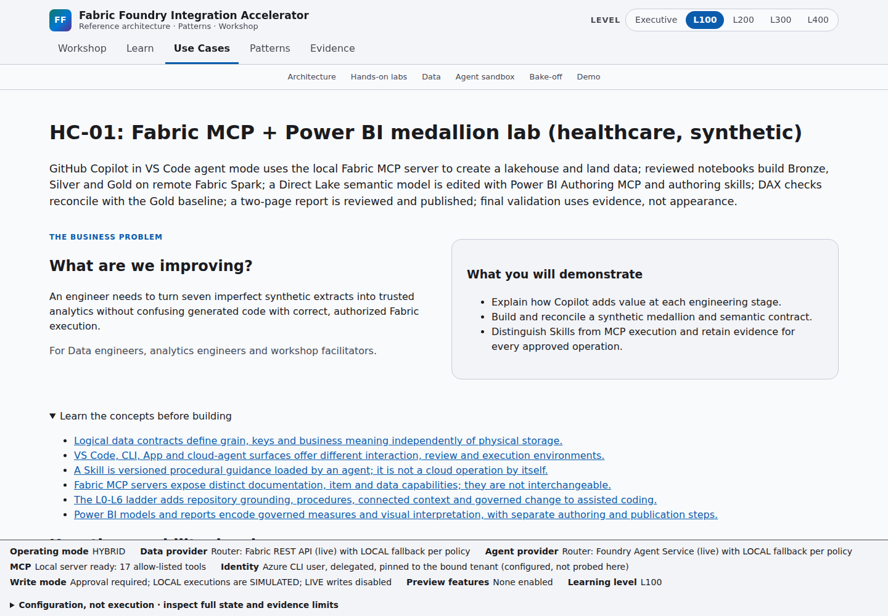
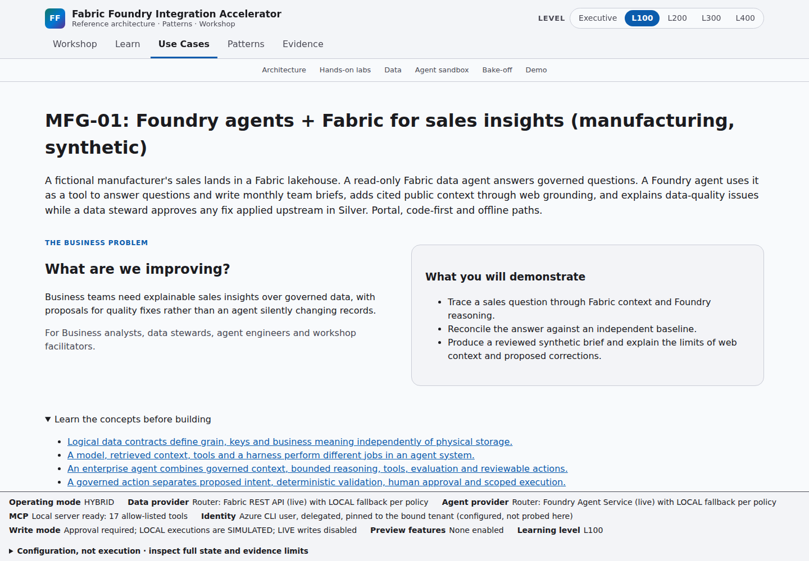
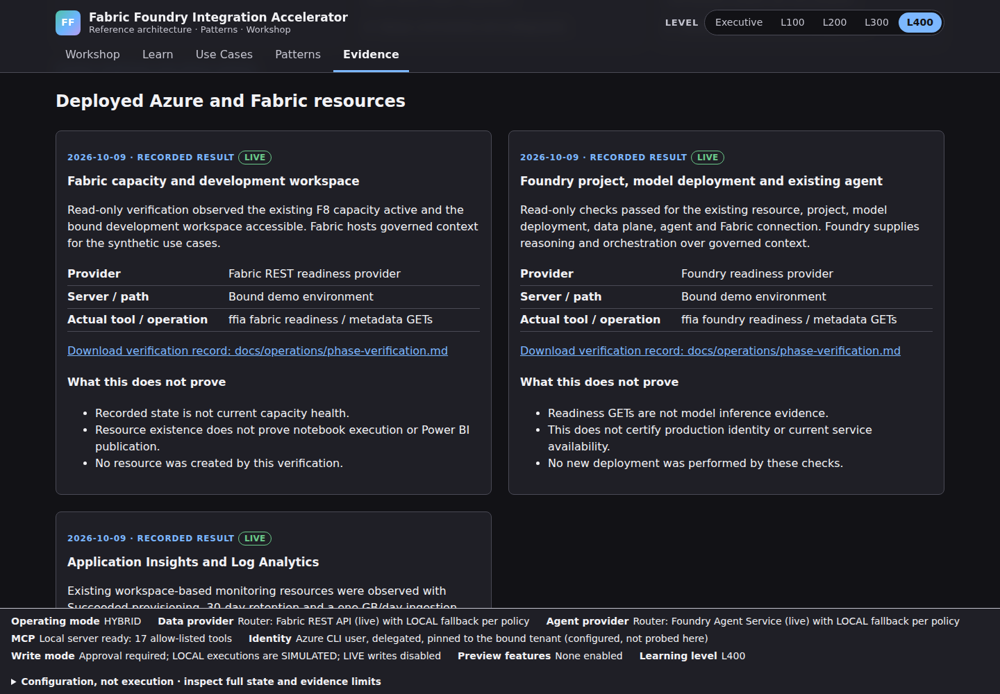
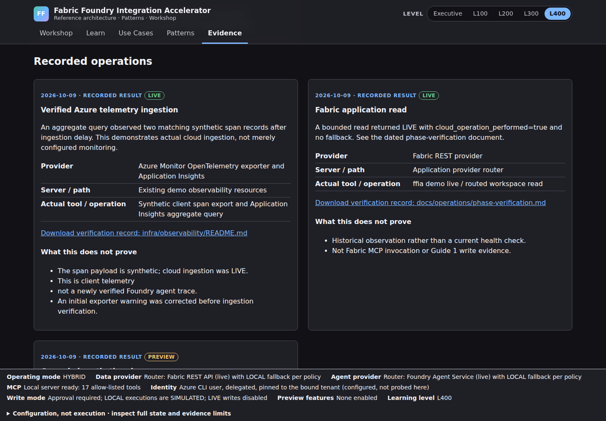

# Workshop learning and applied research

The workshop has two complementary lenses: **Build and verify** answers what, why, when and
how; **Foundations and research** explains underlying theory, its conceptual connection to
today's tools and a proposed reproducible experiment. Both work at Executive-L400 depths.

Authoring lives in [the workshop registry](../../education/workshop.yaml), not React copy.
Every lesson has an instructional brief. Validation rejects missing briefs, duplicate IDs and
unknown lesson, source, pattern, use-case or diagram references.
Every registered use case must have a business-to-build story. All 25 catalogue patterns link
to five-level teaching; shared lessons explicitly teach their related patterns. This is teaching
coverage, not a claim that all patterns have implemented labs or live certification.

## Depth without losing breadth

- Begin with relational data, grain, semantic meaning and model/context/tool boundaries.
- Follow an outcome-led journey into engineering or business-agent implementation.
- Use level-specific content to increase implementation and systems depth.
- Use the research lens to inspect mechanisms, alternatives and threats to validity.
- Use the pattern matrix to find linked lessons, labs, use cases, diagrams and evidence;
  absent coverage remains visible rather than turning into a readiness badge.

Conceptual evolution is not a claim that Fabric, Foundry or Copilot implements a cited paper
exactly. Original research results are not current product benchmarks. Local deterministic
analogs cannot establish language-model performance.

## Applied-research protocol

1. Ask a bounded question and state a falsifiable hypothesis.
2. Select an independent reference, fixed inputs and held-out evaluation questions.
3. Change one variable; record prompt, model, input and tool versions.
4. Measure correctness, failures, source support, access refusal, latency and cost separately.
5. Retain adverse trials, sample sizes and limitations; do not invent productivity gains.
6. Distinguish experiment designs from actual results and from live certification.

Use observable tool events and results, not private chain-of-thought. A research exercise
never grants mutation approval.

## Routes and evidence

`/use-cases` is canonical. Legacy `/guides` URLs redirect while preserving step, query and
fragment. API `/api/v1/guides` remains compatible. `/api/v1/education/workshop` is a LOCAL
read model: it loads teaching and historical evidence, not cloud health.

The coding harness uses Fabric MCP first with the named `ffia-local` fallback. The application
uses Fabric REST / Foundry SDK through its router. REST evidence is not MCP proof.
The `/evidence` gallery records dates, providers, operations, limitations and synthetic UI
images; configured providers and learner checkboxes are not verification.

### Local and connected execution choices

The gallery teaches three choices from the structured workshop registry:

| Choice | Deliberate command | Evidence and fallback |
|---|---|---|
| OFFLINE | `ffia serve api --offline` or `ffia demo offline --json` | LOCAL reads and SIMULATED rehearsals; no cloud calls |
| HYBRID | `ffia serve api` or `ffia demo hybrid --json` | Eligible live reads first, explicitly labeled LOCAL read fallback when permitted |
| LIVE verification | `ffia demo live --json` | Bounded connected read and synthetic model question; local fallback cannot pass the live gate |

Connected commands need private bindings, Entra permission and available services; model usage
and active capacity can incur costs. An approved LIVE write never redirects to LOCAL.
Running the UI, API or Microsoft's Fabric MCP process locally does not make a remote data
operation offline. `ffia serve mcp` is different: it starts the offline `ffia-local` server.

### Existing deployed-environment evidence

The gallery now separates **deployed-resource checks**, **actual recorded operations** and
**local interface evidence**. Recorded read-only checks observed the F8 capacity/development
workspace, Foundry resource/project/model deployment/agent/Fabric connection, and workspace-based
Application Insights/Log Analytics with monitoring connections and diagnostics.

A separate operation record describes the query-confirmed ingestion of two synthetic client
span records. This is LIVE Azure ingestion, not a newly verified server-side Foundry agent trace.
Existing resources were verified rather than redeployed. Records retain their observation
date; they do not claim current health, notebook execution or Power BI publication.

Cards download the actual public [phase verification](phase-verification.md) and
[observability verification](../../infra/observability/README.md) documents. The frontend bundles
those two source files directly; it does not expose arbitrary repository files or private
environment configuration. Public content uses neutral aliases, not tenant identifiers.

See [use-case onboarding](use-case-onboarding.md) and
[the diagram export procedure](../architecture/diagrams/README.md).

## Redesigned interface evidence

These LOCAL browser captures contain synthetic workshop content. HYBRID configuration shown
in the status bar is not a fresh Fabric, Foundry or MCP execution. The historical execution
ledger retains its original dates and limitations.

### Current app captures

Captured directly from the running workshop on **2026-10-09**, at a 1440 x 1100 desktop
viewport. The pages passed browser error, horizontal-overflow and automated WCAG-tagged
accessibility checks before capture. These are synthetic **LOCAL interface images**, not
Azure portal screenshots, a fresh tenant health check or evidence of a cloud operation.

The image captures the viewport rather than the entire page. Follow the app's journeys and
scroll for implementation details, research lenses and dated operation records.

### Earlier redesigned views

Additional captures cover [Learn](../architecture/screenshots/workshop-learn.png),
[pattern coverage](../architecture/screenshots/workshop-patterns.png),
[the evidence gallery](../architecture/screenshots/workshop-evidence.png),
[mobile workshop entry](../architecture/screenshots/workshop-home-mobile.png) and
[the mobile engineering use case](../architecture/screenshots/workshop-use-case-1-mobile.png).

