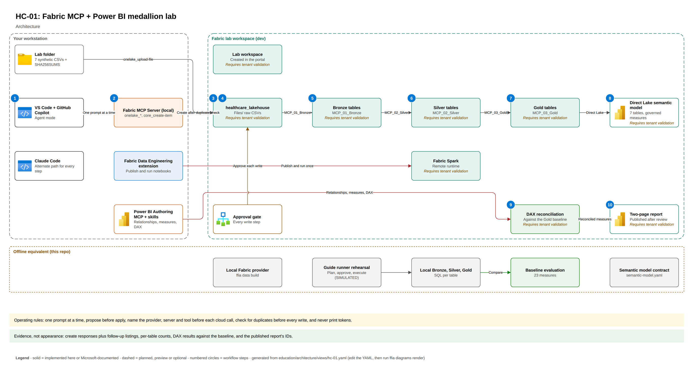

# Guide HC-01: Fabric MCP + Power BI medallion lab (healthcare, synthetic)

VS Code + GitHub Copilot agent mode with the local Fabric MCP server, remote Fabric Spark notebooks (Bronze, Silver, Gold), a Direct Lake semantic model edited through Power BI Modeling MCP and authoring skills, DAX reconciliation, and a two-page report. Every step has a Claude Code path and an offline equivalent. Synthetic data only; no clinical rules.

Populated in: Phase 2-7.

## Architecture



[Editable draw.io source](../../docs/architecture/diagrams/hc-01.drawio) /
[step-by-step architecture explanation](../../docs/architecture/hc-01-architecture.md).
This is the intended workflow, not evidence that tenant writes ran. Claude Code remains
DOCUMENTED ONLY in the bake-off; its alternate prompts are available for each step.

## Available now (Phase 2)

| Asset | Where | Notes |
|---|---|---|
| Source data | Dataset profile `hc-lab-7file-v1` | Same counts and quirks as the guide baseline: 200 / 1,025 / 428 / 1,025 / 4,299 / 643 / 150 |
| Expected baseline | `data/synthetic/expected/hc-lab-7file-v1.json` | Row counts for all 24 tables, Silver diagnostics, reconciliation totals and every measure |
| Semantic model contract | `data/synthetic/semantic/hc-lab-7file-v1/semantic-model.yaml` | 7 tables, star relationships, measure contracts with reference DAX; Bed Occupancy excluded |
| Local reference build | `ffia data build --profile hc-lab-7file-v1` | Offline Bronze/Silver/Gold to compare against the live Fabric run |

Copy the data into a separate lab project folder, as the guide recommends:

```bash
ffia data export --profile hc-lab-7file-v1 --dest ~/hc-01-lab/data/raw
cd ~/hc-01-lab/data/raw && sha256sum -c SHA256SUMS
```

## Available now (Phase 3)

| Asset | Where | Notes |
|---|---|---|
| Guide manifest | `guide.yaml` | 16 steps. Each one has Copilot and Claude Code prompts, a checkpoint, required evidence, an offline equivalent and, where relevant, "not evidence" warnings. Every write step requires approval. |
| Step lookup | `GET /api/v1/guides/hc-01-fabric-mcp-powerbi-medallion-lab/steps/{step_id}` or the `get_guide_step` tool on `ffia-local` | Read-only. LOCAL label. |
| Governed write rehearsal | `POST /api/v1/plans` → `/approvals` → `/fabric/change` with `destination: LOCAL` | SIMULATED. Rehearses the lakehouse, notebook, upload, model and report writes without a tenant. |
| Baseline check | `POST /api/v1/evaluations/run` or the `evaluate_against_baseline` tool | Compares the measures with `data/synthetic/expected/hc-lab-7file-v1.json` |

## Available now (Phase 5)

| Asset | Where | Notes |
|---|---|---|
| Guide-scoped agent files | `AGENTS.md`, `CLAUDE.md`, `.mcp.json` in this folder | `.mcp.json` is the rendered `hc01-lab` profile: the real Fabric MCP server with only the tools steps 02–05 name (writes approved per call), plus `ffia-local` as the labeled fallback. Each step in `guide.yaml` names its Fabric Skills (`skills`) and its fallback (`tool_path.fallback`). |
| VS Code MCP config | `ffia mcp render hc01-lab --client vscode --output <LAB_PATH>/.vscode/mcp.json` | Checked against the pinned Fabric MCP 1.4.0 tool catalog |
| Fabric and Power BI skills | `ffia skills install` | `skills-for-fabric` v0.3.18, SHA-256 verified, 4 curated skills; `az rest` needs approval |
| Reference notebooks | `fabric/workspace/MCP_01_Bronze.Notebook` … `MCP_03_Gold.Notebook` | Fabric Git format; 85/85 checks pass on local Spark 3.5.9 (LOCAL). Running in Fabric requires tenant validation |
| Tenant readiness | `ffia fabric readiness` | Read-only; see `docs/operations/fabric-tenant-readiness.md` |

Step 02 uses `core_search-catalog` and `onelake_list-items`: in a demo tenant with Fabric MCP 1.4.0,
`onelake_list-workspaces` returned an empty list while workspace-scoped calls worked.
