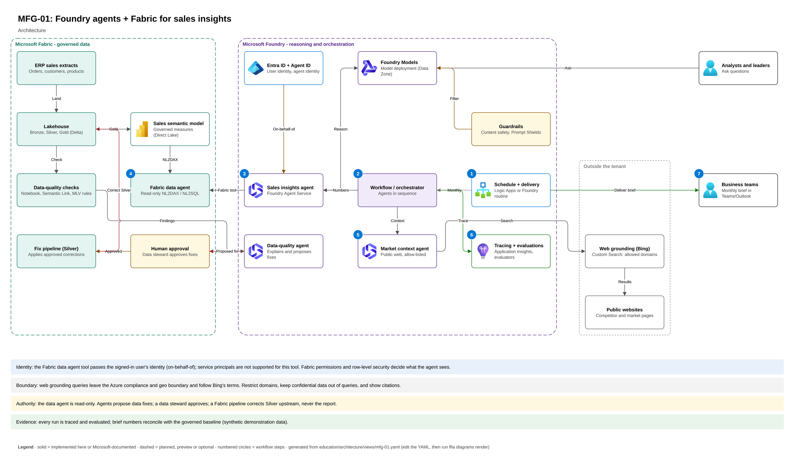

# Guide MFG-01: Foundry agents + Fabric for sales insights (manufacturing, synthetic)

Foundry agents over governed Fabric sales data: a read-only Fabric data agent, a Foundry agent with
the Fabric tool, cited public context, monthly team briefs and data-quality triage. Synthetic data
only; the manufacturer, customers and products are fictional.

| Asset | Where |
|---|---|
| Guide manifest | `guide.yaml` (7 steps; Copilot and Claude Code prompts, checkpoints, offline equivalents) |
| Architecture | `education/architecture/views/mfg-01.yaml` → app `/architecture/mfg-01` |
| Data and baseline | `data/synthetic/raw/mfg-sales-v1/`, `data/synthetic/expected/mfg-sales-v1.json` |
| Offline commands | `ffia mfg brief [--team T-ENC]`, `ffia mfg quality` |
| Code-first samples | `demos/foundry-fabric-agents-workshop/code/` |
| Workshop talk track | `demos/foundry-fabric-agents-workshop/index.html` |

Status: **validated live** on 2026-10-08 in the presenter's demo tenant: steps 02–04 and the
duplicate check in step 07. Steps 05 and 06 are offline-validated; running them live requires
tenant validation.

## Architecture

[Editable draw.io source](../../docs/architecture/diagrams/mfg-01.drawio) /
[interactive architecture](http://localhost:5173/architecture/mfg-01).
This is the intended architecture, not proof that scheduling, delivery or data corrections ran.
Those operations require their own validation and approval. Claude Code remains DOCUMENTED ONLY
in the bake-off.
